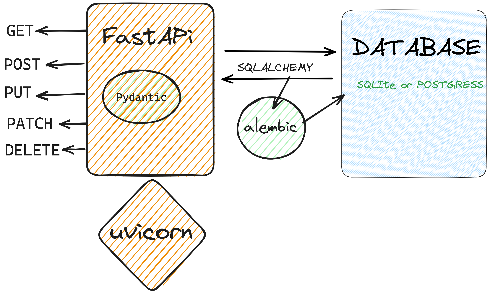

# Fastapi_guide

  

Key  
✔️ - Done   
...✍️ - In Progress     
- Day 1: Introduction
    - [Introduction to Servers](https://github.com/otienosteve/introduction-to-Servers)   ✔️      
    - [Webserver Evolution cgi-fastcgi-wsgi-asgi](https://github.com/otienosteve/web-servers-cgi-fastcgi-wsgi-asgi)  ✔️                  
    - [Introduction to fastapi](https://github.com/otienosteve/intro-to-fastapi)  ✔️  
- Day 2: Get Requests
    - [Getting started With Fastapi ](https://github.com/otienosteve/fastapi-setup)  ✔️       
    - [Video - Making Get Request with Fast API](https://youtu.be/Jv4ZJzLTfmQ)   ✔️      
    - [Making Get Requests with Fastapi ](https://github.com/otienosteve/get-requests-with-fastapi) ✔️        
    - [Get Request Lab](https://github.com/otienosteve/python-p3-get-request-lab)   ✔️      
- Day 3: Intro to Pydantic, Post Put Request
    - [Introduction to Pydantic and Parameters Code Along](https://github.com/otienosteve/intro-to-pydantic)  ✔️           
    - [Video - Making Post Put Request](https://youtu.be/2hUYrYTanG0)   ✔️    
    - [Post Put Request Code Along](https://github.com/otienosteve/post-put-request-code-along)  ✔️         
    - [Post Put Request Lab](https://github.com/otienosteve/python-p3-post-put-request-lab/)  ✔️  
- Day 4: Pydantic Validation and Parsing
    - [Pydantic Validation and Parsing Lesson ](https://github.com/otienosteve/pydantic-validation-and-parsing)  ✔️        
    - [Pydantic Validation and Parsing code along ](https://github.com/otienosteve/pydantic-validation-code-along) ✔️    
    - [Pydantic Lab](https://github.com/otienosteve/pydantic_lab)  ...✍️       
- Day 5: Patch delete Request
    - [Video - Making Patch Delete Request](https://youtu.be/I9IJdTqyIaM?list=PLqVWkj8fK0M231C7JKK3EzXxUZrzICTIq)   ✔️  
    - [Patch Delete Request Code Along](https://github.com/otienosteve/fastapi-patch-delete-request-code-along)  ✔️      
    - [Patch Delete Request Lab](https://youtu.be/I9IJdTqyIaM)  ✔️    
- Day 6 : Relations and Fastapi  
    - [Setting up relationships](https://github.com/otienosteve/setting-up-relationships-in-sqlalchemy)       ✔️     
    - [Working with relations Video]() ...✍️   
    - [Working with Relations in Fast API](https://github.com/otienosteve/working-with-related-database-data-in-fast-api)    ✔️  
    - [Working With Relations Lab]() ...✍️    
- Day 7: Modularity, connecting backend and frontend, cloudinary  ...✍️  
- Day 8: Authentication ...✍️  
- Day 9: WebSockets,...✍️  
- Day 10: Tanstack and Fatsapi ...✍️  
- Day 11: Deployment ...✍️  
- [Mini Project](https://github.com/otienosteve/fast-api-mini-project)  ...✍️  
